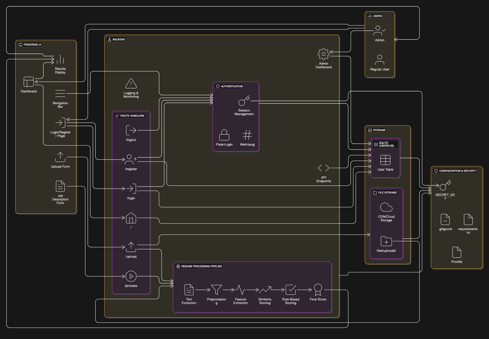

# Resume Parser & Shortlisting Web App

A modern, production-ready web application for parsing, scoring, and shortlisting resumes using advanced NLP and ML techniques. Built with **Streamlit** for easy deployment and maintenance, featuring a clean, professional UI with no authentication complexity.

---

## 🚀 Features

- **Simple & Fast**: No authentication required - just upload and process
- Upload multiple resumes (PDF, DOCX)
- Paste job descriptions for smart matching
- Advanced NLP pipeline: text extraction, preprocessing, feature extraction, similarity & rule-based scoring
- Real-time scoring with detailed breakdown (1-10 scale)
- Downloadable results as CSV
- Beautiful, responsive Streamlit UI
- Easy deployment on Streamlit Cloud, Render, or any platform

---

## 🏗️ Architecture



- **Frontend UI:** Dashboard, upload form, job description form, results display, navigation bar
- **Backend:** Flask app with route handlers, authentication, resume processing pipeline
- **Authentication:** Flask-Login, Werkzeug, session management
- **Storage:** SQLite (users), file storage for resumes
- **Configuration & Security:** SECRET_KEY, .gitignore, requirements.txt, Procfile

---


## ⚙️ Setup & Deployment

### Local Setup

1. **Clone the repo:**
```bash
git clone https://github.com/yourusername/your-repo-name.git
cd your-repo-name
```

2. **Install dependencies:**
```bash
pip install -r requirements.txt
```

3. **Run the Streamlit app:**
```bash
streamlit run streamlit_app.py
```

**OR use the deployment script:**
```bash
python deploy_streamlit.py
```

4. **Access the app:**
   Visit [http://localhost:8501](http://localhost:8501)

### Deploy on Streamlit Cloud (Recommended)

1. Push your code to GitHub
2. Go to [share.streamlit.io](https://share.streamlit.io)
3. Connect your GitHub repository
4. Set the main file path to `streamlit_app.py`
5. Deploy! Your app will be live in minutes

### Deploy on Render

1. Push your code to GitHub
2. Create a new Web Service on [Render](https://render.com)
3. Set the build command: `pip install -r requirements.txt`
4. Set the start command: `streamlit run streamlit_app.py --server.port $PORT --server.address 0.0.0.0`
5. Deploy!

---

## 🛠️ Tech Stack

- **Frontend:** Streamlit (Python web framework)
- **Backend:** Python, Pandas, NumPy
- **ML/NLP:** scikit-learn, NLTK
- **File Processing:** PyPDF2, python-docx
- **Deployment:** Streamlit Cloud, Render, or any platform

---

## 📂 Project Structure

```
.
├── streamlit_app.py          # Main Streamlit application
├── deploy_streamlit.py       # Deployment helper script
├── requirements.txt          # Python dependencies
├── .streamlit/config.toml    # Streamlit configuration
├── scoring.py               # Resume scoring logic
├── extract_txt.py           # Text extraction from files
├── model.py                 # ML models
├── features.py              # Feature extraction
├── entities.py              # Entity extraction
├── text_processing.py       # Text preprocessing
├── Data/                    # Skills data
└── README.md
```

---

## 🔒 Security & Privacy

- No user authentication required - simple and direct
- Files are processed in-memory and not stored permanently
- No sensitive data is collected or stored
- Session-based processing for privacy

---


