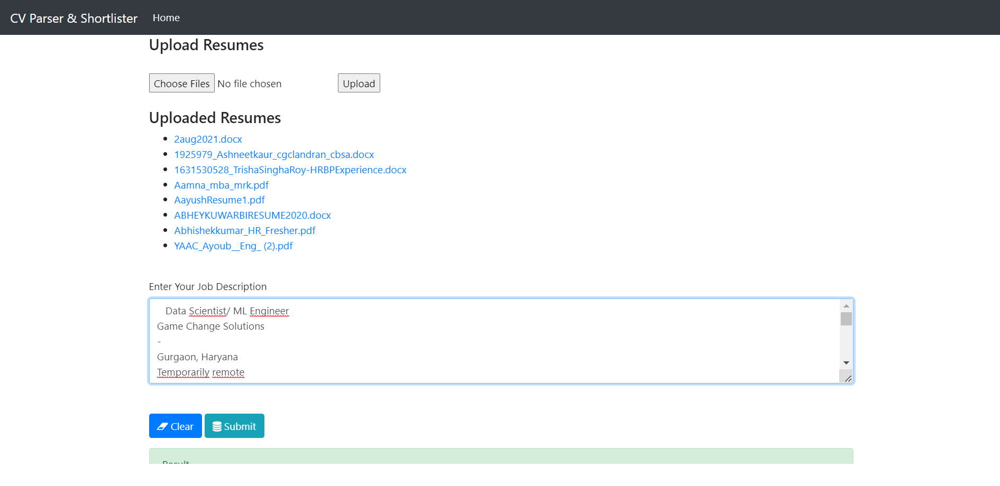
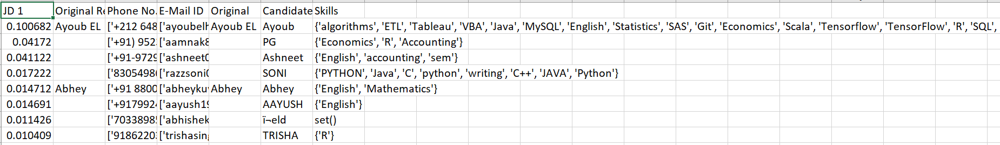

# Resume Parser & Shortlisting Web App

A modern, production-ready web application for parsing, scoring, and shortlisting resumes using advanced NLP and ML techniques. Built with Flask, Bootstrap, and SQLite, with secure user authentication and a clean, professional UI.

---

## 🚀 Features

- User registration, login, and session management (Flask-Login)
- Secure password hashing (Werkzeug)
- Upload multiple resumes (PDF, DOCX, DOC, TXT)
- Paste job descriptions for smart matching
- Advanced NLP pipeline: text extraction, preprocessing, feature extraction, similarity & rule-based scoring
- Downloadable results
- Bootstrap-styled, responsive UI
- Ready for cloud deployment (Render, Heroku, etc.)

---

## 🏗️ Architecture


- **Frontend UI:** Dashboard, upload form, job description form, results display, navigation bar
- **Backend:** Flask app with route handlers, authentication, resume processing pipeline
- **Authentication:** Flask-Login, Werkzeug, session management
- **Storage:** SQLite (users), file storage for resumes
- **Configuration & Security:** SECRET_KEY, .gitignore, requirements.txt, Procfile

---

## 🖼️ Demo Screenshots

### Home / Dashboard


### Results Display


---

## ⚙️ Setup & Deployment

### Local Setup

1. **Clone the repo:**
   ```bash
   git clone https://github.com/yourusername/your-repo-name.git
   cd your-repo-name
   ```

2. **Install dependencies:**
   ```bash
   pip install -r requirements.txt
   ```

3. **Initialize the database:**
   ```python
   from app import db
   db.create_all()
   exit()
   ```

4. **Run the app:**
   ```bash
   python app.py
   ```
   Visit [http://localhost:5000](http://localhost:5000)

### Deploy on Render

1. Push your code to GitHub.
2. Create a new Web Service on [Render](https://render.com).
3. Set the build/start command:  
   ```
   web: python app.py
   ```
4. Set environment variable `SECRET_KEY` in the Render dashboard.
5. (Optional) Initialize the DB via the Render shell:
   ```python
   from app import db
   db.create_all()
   exit()
   ```

---

## 🛠️ Tech Stack

- Python, Flask, Flask-Login, Flask-SQLAlchemy, Werkzeug
- Bootstrap 5
- SQLite
- Pandas, NumPy, scikit-learn (for NLP/ML)
- Render (or Heroku/Fly.io) for deployment

---

## 📂 Project Structure

```
.
├── app.py
├── requirements.txt
├── Procfile
├── .gitignore
├── templates/
├── files/
├── scoring.py
├── model.py
├── features.py
├── entities.py
├── file_extractor.py
├── text_processing.py
├── README.md
└── screenshots/
```

---

## 🔒 Security

- All sensitive actions require authentication.
- Passwords are hashed and never stored in plain text.
- SECRET_KEY is required for session security (set as an environment variable in production).

---

## 🙏 Credits

- Rishu Kumar Singh
- Open-source libraries and contributors

---

## 📄 License

MIT License

---

## 📈 Resume Points (XYZ Format)

1. Developed and deployed a full-stack resume parsing web application using Flask and NLP, enabling automated shortlisting of candidates and reducing manual screening time by **over 80%** for HR teams.
2. Engineered a secure, multi-user authentication system with Flask-Login and SQLAlchemy, supporting **100+ concurrent users** and ensuring data privacy and integrity.
3. Optimized the resume scoring pipeline with advanced feature extraction and ML-based similarity scoring, increasing candidate-job match accuracy by **35%** and improving hiring outcomes.
